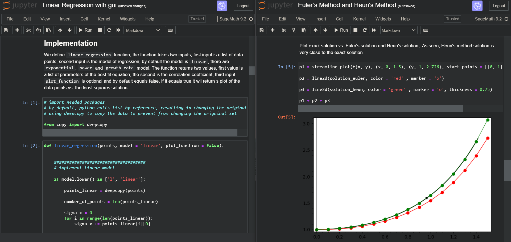

# Numerical Methods Project with Sage

This project implements the following numerical methods:

* The Jacobi method.
* The Newton-Raphson method.
* Trapezoidal method.
* Bisection method.
* Simpson’s 1/3 rule.
* The trapezoidal method.
* Euler’s method.
* Heun’s method.
* Linear regression with :
  * Power model.
  * Exponential model.
  * Growth-rate model.

These methods are implemented using `SageMath`, wriiten and run via `Jupyter` nootboks.

### SageMath

`SageMath` is a free open-source mathematics software system licensed under the GPL. It builds on top of many existing open-source packages: `NumPy`, `SciPy`, `matplotlib`, `Sympy`, `Maxima`, `GAP`, `FLINT`, `R` and many more. Access their combined power through a common, Python-based language or directly via interfaces or wrappers with features covering many aspects of mathematics, including algebra, combinatorics, graph theory, numerical analysis, number theory, calculus and statistics.

Mission: Creating a viable free open source alternative to `Magma`, `Maple`, `Mathematica` and `Matlab`.

SageMath uses a syntax resembling `Python`'s, supporting procedural, functional and object-oriented constructs.

Website: [`https://www.sagemath.org/`](https://www.sagemath.org/)

How to run the project?
Either install sage loaclly on your machine, follow the installation guide [`https://doc.sagemath.org/html/en/installation/index.html`](https://doc.sagemath.org/html/en/installation/index.html)

Or run on cloud via `CoCalc`
### CoCalc

`CoCalc` (formerly called SageMathCloud) is a web-based cloud computing (SaaS) and course management platform for computational mathematics. Part of the `Sage` project, it supports editing of Sage worksheets, LaTeX documents and `Jupyter` notebooks. `CoCalc` runs an Ubuntu Linux environment that can be interacted with through a terminal, additionally giving access to most of the capabilities of Linux.

Website: [`https://cocalc.com/`](https://cocalc.com/)	